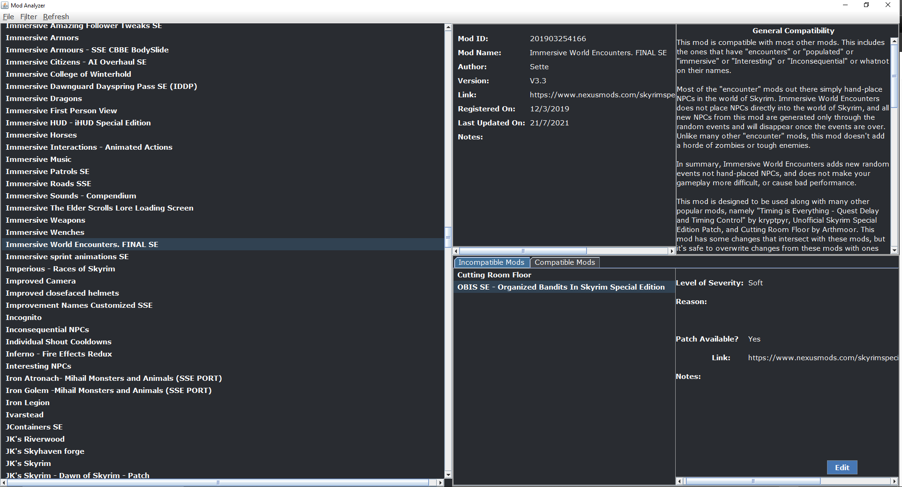
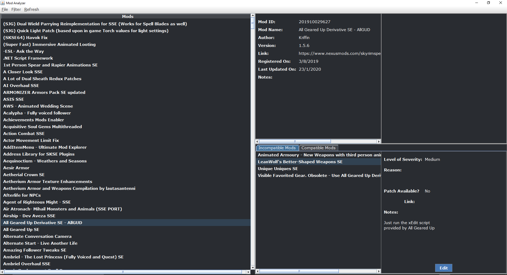
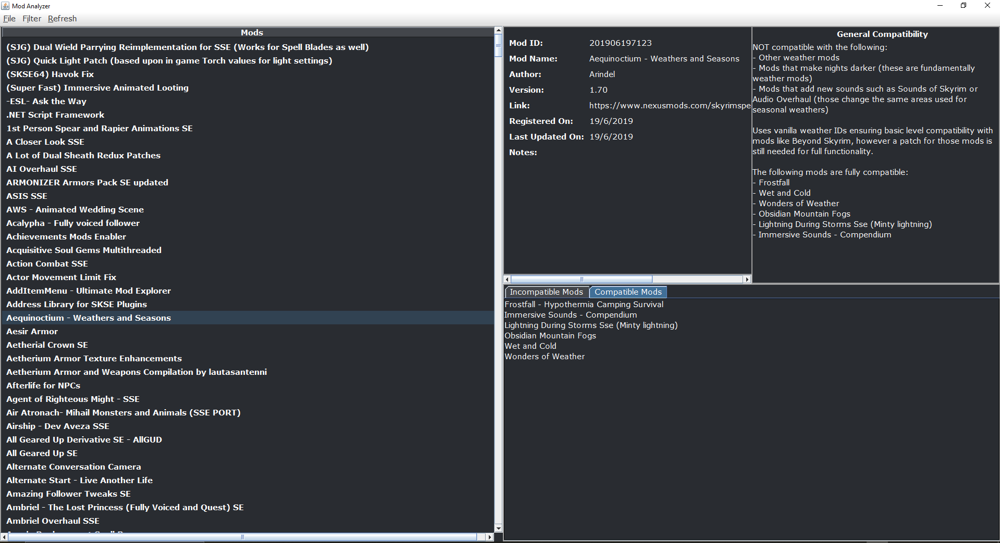

<div id="top"></div>

<!-- PROJECT SHIELDS -->
<!--
*** I'm using markdown "reference style" links for readability.
*** Reference links are enclosed in brackets [ ] instead of parentheses ( ).
*** See the bottom of this document for the declaration of the reference variables
*** for contributors-url, forks-url, etc. This is an optional, concise syntax you may use.
*** https://www.markdownguide.org/basic-syntax/#reference-style-links
-->
<!-- [![Contributors][contributors-shield]][contributors-url]
[![Forks][forks-shield]][forks-url]
[![Stargazers][stars-shield]][stars-url]
[![Issues][issues-shield]][issues-url]
[![MIT License][license-shield]][license-url] -->
<!-- [![LinkedIn][linkedin-shield]][linkedin-url] -->


<!-- PROJECT LOGO -->
<br />
<div align="center">
  <!-- <a href="https://github.com/GiantSweetroll/Mod-Analyzer">
    
  </a> -->

  <h3 align="center">Mod Analyzer</h3>

  <p align="center">
    A database software to keep track of mod conflicts
  </p>
</div>
<br>


<!-- TABLE OF CONTENTS -->
<details>
  <summary>Table of Contents</summary>
  <ol>
    <li>
      <a href="#about-the-project">About The Project</a>
      <ul>
        <li><a href="#built-with">Built With</a></li>
      </ul>
    </li>
    <li>
      <a href="#getting-started">Getting Started</a>
      <ul>
        <li><a href="#prerequisites">Prerequisites</a></li>
        <li><a href="#installation">Installation</a></li>
      </ul>
    </li>
    <li><a href="#usage">Usage</a></li>
    <!-- <li><a href="#roadmap">Roadmap</a></li> -->
    <!-- <li><a href="#contributing">Contributing</a></li> -->
    <!-- <li><a href="#license">License</a></li> -->
    <!-- <li><a href="#acknowledgments">Acknowledgments</a></li> -->
    <li><a href="#screenshots">Screenshots</a></li>
  </ol>
</details>


<!-- ABOUT THE PROJECT -->
## About The Project



This project was part of my project for IB DP Computer Science Internal Assessment.

I developed a program to assist me in managing the mods I use for games, particularly games from Bethesda Softworks, such as Skyrim and Fallout 4. My client for this project is myself. When I play Fallout 4 and Skyrim, I use a lot of mods made by different people from various websites, primarily Nexus Mods. Since these mods are created by different people, it is often to find conflicts or incompatibilities, ranging from bugs in the game, all the way to constant crashing to desktop.
These issues can be caused by many things, but most of the time it is caused by mods editing the same items in the vanilla game, such as mod “A” and mod “B” both edit the same NPCs or adding stuff in the same world coordinate. Though some mod authors do provide compatibility patches for their mods for other mods, some of these compatibility patches are scattered across the web and mod users are sometimes unaware that the mod their using provides patches for another mod they are also using. This is often the case for me, when I just realize that a compatibility patch is needed for a mod I am using way too late, when I’ve gone so far in the game and finding the issues, in which I will need to start a new game to use the patch.

The proposed product is a database program that will be able to browse through its database and alert users of mods that are incompatible with other mods and notify if a patch is provided or available. This program will save time for mod users that would otherwise be used to search the web to check if a mod they want to use is compatible with mod x, y, z in which they are already using. I see this program to be very beneficial for me, as right now I am considering to use a mod called
“Legacy of the Dragonborn”, in which a lot of the mods I am using provides a patch for it, but at the time I didn’t consider using it so I didn’t download the patch for the mod. If I had this program, I would not have to look for these patches all over again. The product will be written in Java as I have a lot more experience in it compared to other programming languages such C++ and C#, or in utilities such as Scratch. Writing it in Java also allow the product to be used in another operating system such as iOS in Mac.

<div align="right">(<a href="#top">back to top</a>)</div>


### Built With

This project was made using [Java](https://www.java.com/en/).

<div align="right">(<a href="#top">back to top</a>)</div>


<!-- GETTING STARTED -->
## Getting Started

To get a local copy of the project up and running , follow these simple steps.

### Prerequisites
- JDK 8 (or newer)
- [GG-Library](https://github.com/GiantSweetroll/GG-Library)
- [Eclipse](https://www.eclipse.org/ide/) (Optional)

<i>Note: This project was created using the Eclipse IDE and is recommended to open and edit the contents of the project. You may use other IDEs that suits your best.</i>

### Installation

1. Clone the repo
   ```sh
   git clone https://github.com/GiantSweetroll/Mod-Analyzer.git
   ```
2. Configure the build path to point to where you downloaded GG-Library and JDK in your local machine
3. Run `Main.java` inside `Mod Analyzer/src/main/`.

<div align="right">(<a href="#top">back to top</a>)</div>


<!-- USAGE EXAMPLES -->
## Usage
To see how to use the app, please refer to this video demo [here](https://youtu.be/L8rQTe-gHno).

<div align="right">(<a href="#top">back to top</a>)</div>

<!-- SCREENSHOTS -->
## Screenshots

<details>
    <summary>Screenshots</summary>
    
    
    
    
    
    
    
</details>

<div align="right">(<a href="#top">back to top</a>)</div>
